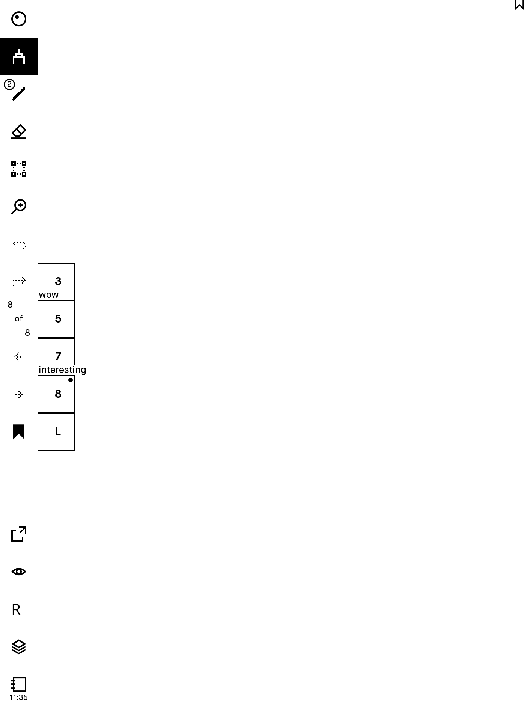
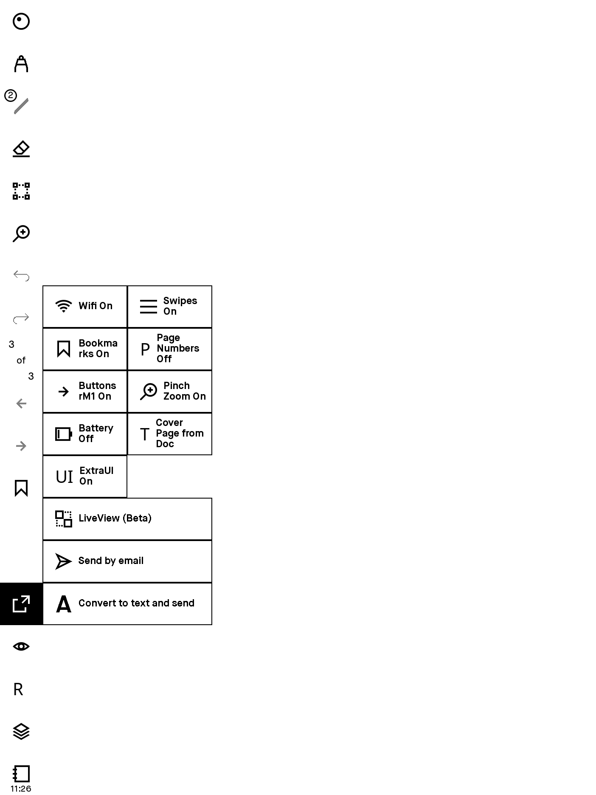

# Binary patches for the rM

## Versions 1.8.1.1-2.5.0.27
Those are features that I find useful/wanted for me to have. If someone else would like to try them, they are welcome.


## Disclaimer
*The files are offered without any warranty and you will be violating the reMarkable AS EULA by using them.
There may be bugs, you may lose data, your device may crash, etc.*

*The only guarantee is, that there is no ill intended code*

I am not affiliated with reMarkable AS in anyway

## Demo

<p align="center">
    
    
    
    
</p>


## Changes
- rm2 [2.5.0.27](patches/25027_rm2/readme.md)
- rm1 [2.5.0.27](patches/25027_rm1/readme.md)
- rm2 [2.4.1.30](patches/24130_rm2/readme.md)
- rm1 [2.4.1.30](patches/24130_rm1/readme.md)
- rm2 [2.4.0.27](patches/24027_rm2/readme.md)
- rm1 [2.4.0.27](patches/24027_rm1/readme.md)
- rm2 [2.3.1.27](patches/23127/readme.md)
- rm2 [2.3.0.23](patches/23023/readme.md)
- rm1 [2.3.0.16](patches/23016/readme.md)
- rm2 [2.2.1.82](patches/22182/readme.md)
- [2.2.0.48](patches/22048/readme.md)
- [2.1.1.3](patches/2113/readme.md)
- [2.0.2.0](patches/2020/readme.md)
- [1.8.1.1](patches/1811/readme.md)


## Quick Doc

Note: the reMarkable 2 does not have buttons

#### Gestures
- pinch to zoom in/out (has to be enabled first in the Share menu)
- swipe down in the middle of the screen, to toggle side-menu
- swipe down from the top edge to close document (existing rM gesture, not a hack)
- two finger swipe down to switch to previous document
- two finger swipe up *or* long press home button for recent files
    - long press on a recent file that was deleted but not synced to restore it
- swipe up, top menu corner: switch between eraser/pen
- swipe down, top menu corner: switch between last 2 pens
- swipe up, top bookmark corner: cycle pen colors
- swipe left, top middle: undo
- swipe right, top middle: redo

#### Bookmarks
- tap upper right (or left for lefthanders) corner to bookmark a page
- long press on bookmark to edit its description (also works in bookmark list in side-menu)

#### Zen Mode
- Enter/Exit: left & right buttons simultaneously *or* long press on the "toggle menu" (uppermost)
- Gestures (swipe gestures work in a small area under the "toggle menu" icon)
    - left button (or right button for lefthanders) *or* swipe up toggles eraser
    - right button (or left button for lefthanders) *or* swipe down toggles last tool
    - long press left button (or right button for lefthanders) or swipe left to undo
    - swipe right to redo

#### Reading Mode
- Enter: home & right buttons simultaneously *or* tap M in the side-menu "Document Menu" (bottommost)
- Exit: left & right buttons simultaneously *or* open side-menu and long press on the "toggle menu" (uppermost)
- Gestures:
    - tap left or right side of screen to change pages

## Extras
- email and hwr for scribbles on pdfs
- extract scribbles from pdfs into new notebook
- clock (check the Timezones)

## Known issues
- had to remove the tooltips / tutorial

# Installation
Find the ssh password (**write it down and keep it safe**)  

in the newest version:
    Settings->Help->Copyright and Licenses (under GPLv3 Compliance)
versions < 2.3:
    Settings->About->Copyright->General Information


**It is really important to have the password somewhere, in case something goes wrong**


## Linux
You got this

## Windows 10
open a command line prompt (Win-R, type cmd, enter)
ssh root@10.11.99.1 (type the password)
or install Putty and enter 10.11.99.1 as address and root for username
paste the automagic line

## macOS
open Spotlight (Cmd-Space) type Terminal, enter
ssh root@10.11.99.1 (type the password)
paste the automagic line

# Automagic

**Make sure the device has Internet connectivity i.e. Wifi is ON and connected**

Paste the following and press enter:
```
sh -c "$(wget https://raw.githubusercontent.com/ddvk/remarkable-hacks/master/patch.sh -O-)" 
```
to try a different patch:

```
sh -c "$(wget https://raw.githubusercontent.com/ddvk/remarkable-hacks/master/patch.sh -O-)" _ patch_xxx 
```
where xxx is the patch number

The app should start, play with it, but press **CTRL-C** (Hold the Control key and press C) to stop it when done **DON'T LEAVE IT JUST RUNNING** and follow the instructions after pressing **CTRL-C**

**Should Press 'Y' and then Enter when asked to make it permanent**

# Notes
patches are cumulative (the last one contains all previous changes and gets updated with bugfixes)
a patch can be applied more than once, it's more of a snapshot really, you can go back to a previous version


## Timezones
The time is in UTC. In order to have the right time, the right timezone should be set (which has things like Daylight Saving Time, utc offsets etc).

Check the list of timezones in [Timezones](docs/timezones.md)  
To set a timezone, run this on the device, by setting one that matches your location e.g.  
`timedatectl set-timezone "Europe/Paris"` or  
`timedatectl set-timezone "America/Denver"`

The device doesn't have all possible timezones. If yours is missing from the list, find a linux distro and copy the missing time zone to `/usr/share/zoneinfo/` then execute the above command with the new zone.

## Extra fonts (e.g Japanese)
The rootfs doesn't have enough space, so you can do this (copy paste in the rm terminal)  
```
mv /usr/share/fonts/ttf ~/ttf
ln -sf /home/root/ttf /usr/share/fonts/ttf
wget https://github.com/tony/dot-fonts/raw/master/Hanazono/HanaMinA.ttf -O ~/ttf/HanaMinaA.ttf
wget https://github.com/tony/dot-fonts/raw/master/Hanazono/HanaMinB.ttf -O ~/ttf/HanaMinaB.ttf
```
for japanese: HanaMinA.ttf and HanaMinB.ttf seem ok  
put new fonts in `/home/root/ttf`,  do `fc-cache` and restart xochitl


## Making it permanent
You should have typed 'Y' when asked

## Revert in case things go terribly wrong
ssh
```
systemctl stop xochitl
rm -fr .cache/remarkable/xochitl/qmlcache/*
cp /home/rmhacks/xochitl.version /usr/bin/xochitl #where version is the current device version
systemctl start xochitl
```


# [Features compiled by u/TheTomatoes2](docs/features.md)


## FAQ

#### How do you make the patches?
I wrote some tools, I change the code, I patch

#### Why is this not open source?
I don't own the source, the legality is dubious, not in reMarkable AS's best interest due to various reasons, etc

#### Can you add this or that feature?
Some things are hard, very time consuming or even impossible for my skill level. I prefer to take a more pragmatic approach and add things that are easy, but from which most users can benefit.

#### What happens when a new offical version comes out? 
You lose the hacks when the device auto updates (If you want to prevent this disable auto updates). When the patches have been ported, you can install them again (bookmarks stay on the device and will reappear) 
