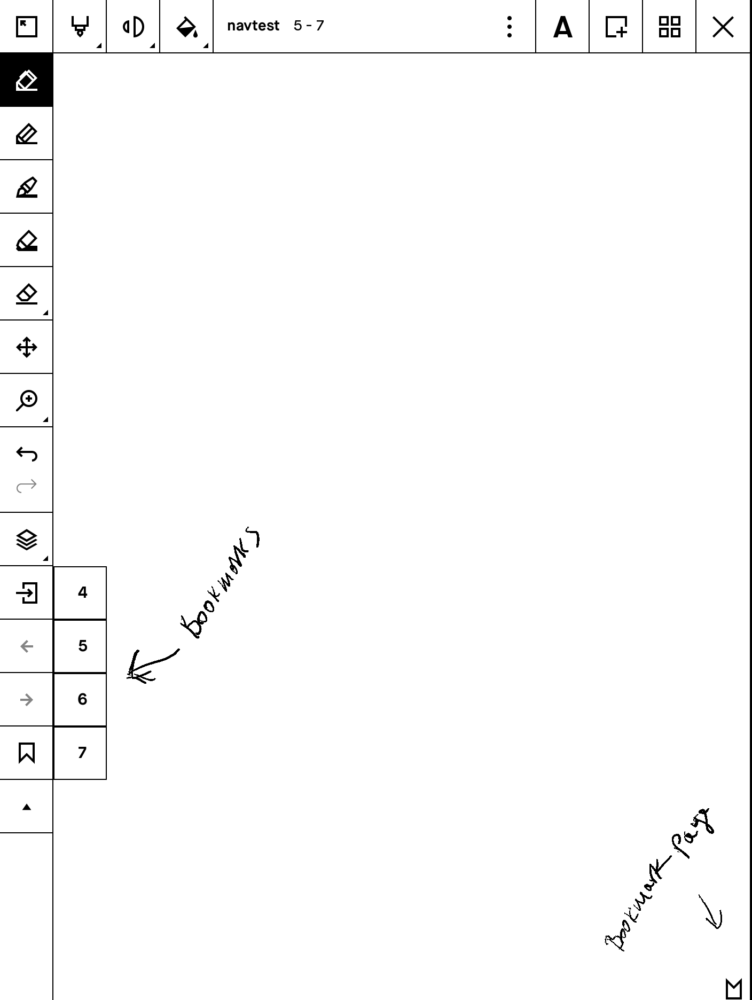

# Binary patches for the rM
Those are features that I find useful/wanted for me to have. If someone else would like to try them, they are welcome.


## Disclaimer
*The files are offered without any warranty and you will be violating the reMarkable SA EULA by using them.
There may be bugs, you may loose data, etc.*

*The only guarantee is, that there is no ill intended code*

## Demo
[Demo](https://www.reddit.com/r/RemarkableTablet/comments/dw7toa/i_had_a_slow_pdf_managed_to_fix_it_by_replacing/)



## Changes
### patch_06
- gotopage (numpad input)
### patch_05
- bookmark for the last page (go to last page)
### patch_04
- bookmark jumps added to the jump history
- cancel direct gotopage returns to document
- (bugfix) go to bookmarked folder in list mode
### patch_03
- Bookmarks (persistent, saved besides the original file with .bookm extension)
- jump forth and back (toc, goto page or bookmark)

### patch_02
- UI button size reduced (in order to pack more buttons) + some alignment issues

### patch_01
- show always the first page (cover) in Overview
- remove the thumbnails in listview
- reduce the height of the items in listview
- undo/redo buttons latency
- toc button
- gotopage button
- jump list with back button (on page change by toc ,gotopage)
- scroll by a whole page in toc and listview
- (kinda bugfix) do not reset the table of contents everytime it is shown


## TODO
- change the default tool
- drawing primitives?


## Things that I would like to do but are hard
- pdf link navigation
- djvu support


## Installation
on the device (Rm->About->Copyright->General Information) write down, remember the password shown


## Linux
You got this


# Windows 10
open a command line prompt (Win-R, type cmd, enter)
ssh root@10.11.99.1 (type the password)
or install Putty and enter 10.11.99.1 as address and root for username
paste the automagic line

# macOS
open Spotlight (Cmd-Space) type Terminal, enter
ssh root@10.11.99.1 (type the password)
paste the automagic line

# Automagic
paste the following and press enter (replace _01 with _02 etc to use a different patch):
```
wget https://raw.githubusercontent.com/ddvk/remarkable-hacks/master/patch.sh -O- | sh -s -- patch_06
```
you will see a bunch of log messages, the app will start, play with it but press **CTRL-C** to stop it when done (DON'T LEAVE IT JUST RUNNING) and follow the instructions (i.e make it permanent or just start the stock one). 

### Notes
patches are cumulative (the last one contains all previous changes and gets updated with bugfixes)
a patch can be applied more than once, it's more of a snapshot really, you can go back to a previous version


# NB WARNING
Always clear the qml cache before switching/running versions manually (the script already does that). Failing to do so will result in a crash

## Making it permanent

After making sure everything is ok (i.e. no crashes) if you want to make it permanent (until the next sw update), you can replace the original, before running the original or rebooting (make sure you read the WARNING above)
```
#if you ran a different version
rm -fr .cache/remarkable/xochitl/qmlcache/*

cp xochitl.patched /usr/bin/xochitl
systemctl start xochitl
```


## Revert in case things go terribly wrong
ssh
```
systemctl stop xochitl
rm -fr .cache/remarkable/xochitl/qmlcache/*
cp xochitl.backup /usr/bin/xochitl
systemctl start xochitl
```
